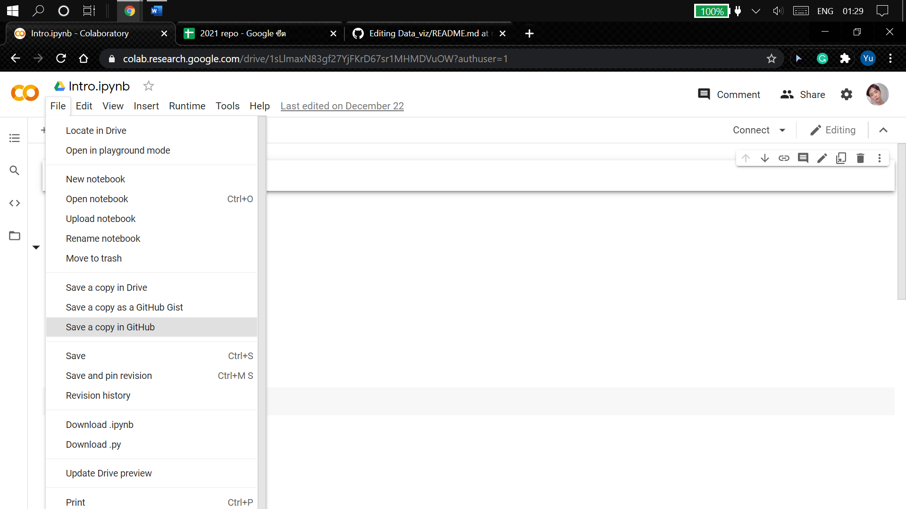
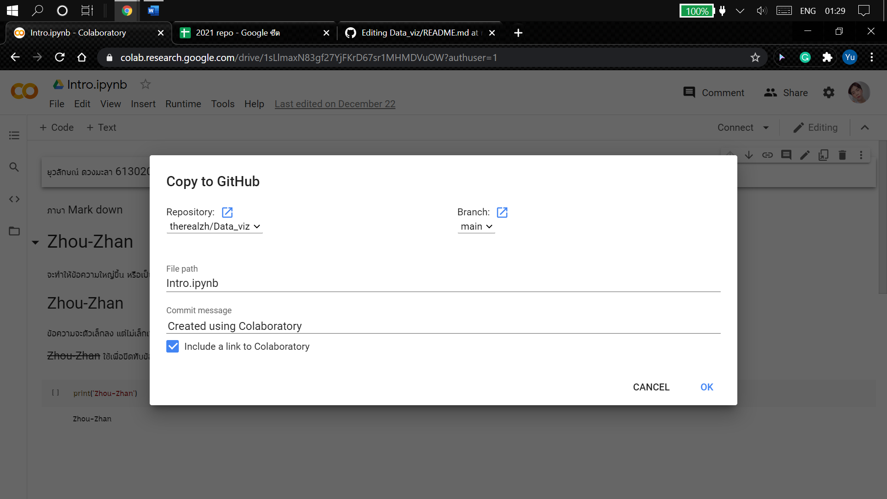
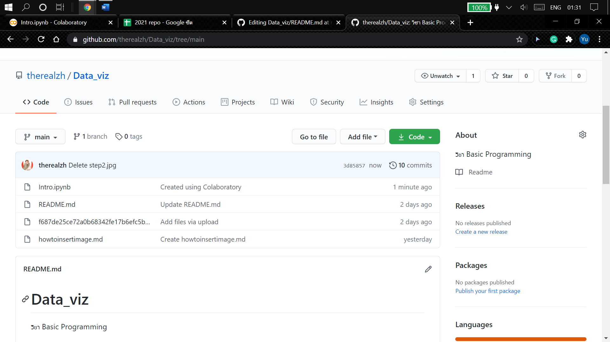

# Data_viz
วิชา Basic Programming 

ยุวลักษณ์ ดวงมะลา 613020196-2

ตัวอย่างการแทรกรูป

# ขั้นตอนการบันทึกไฟล์ จาก ฌนนเสำ Colab เข้าสู่ Github
1. ไปที่เว็บไซต์ Google Colab เลือกที่ต้องการบันทึก จากนั้นเลือกที่ File >> Save a copy in Github 

2. เลือก Repository ไปยัง Github ของตนเอง จากนั้นกด OK

3. หลังจากนั้นจะมีไฟล์ที่บันทึกจาก Google Colab ขึ้นอยู่ใน Github

